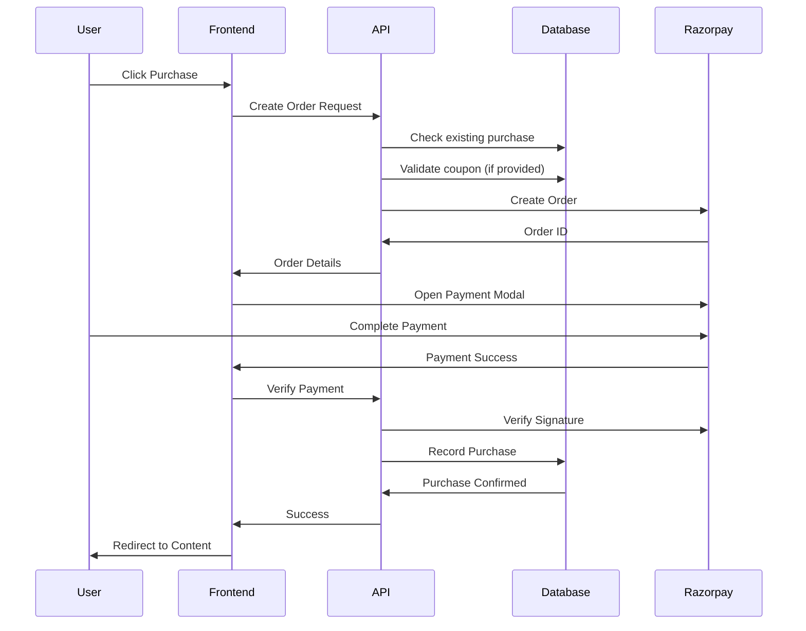

FTB Hustle offers premium learning toolkits to help you develop skills and advance your career. This guide covers everything you need to know about browsing, purchasing, and accessing toolkit content.

## What are Toolkits?

Toolkits are curated learning resources created by experts, containing:

- **Video lessons** - High-quality instructional videos
- **Written articles** - In-depth guides and tutorials
- **Practical exercises** - Hands-on learning materials
- **Lifetime access** - Learn at your own pace, forever

### Toolkit Information

Each toolkit includes:

- **Title and description** - Clear overview of what you'll learn
- **Price** - One-time payment for lifetime access
- **Original price** - Discounted from original price (if on sale)
- **Cover image** - Visual representation of the toolkit
- **Preview video** - YouTube promotional video (optional)
- **Category** - Subject area (Career, Skills, Technology, etc.)
- **Highlights** - Key features and benefits
- **Lesson count** - Number of lessons included
- **Total duration** - Estimated time to complete
- **Creator information** - Who created the toolkit

<Note>
  All prices are in Indian Rupees (₹). Payment is processed securely through Razorpay.
</Note>

## Browsing Toolkits

<Steps>
  <Step title="Navigate to toolkits">
    Access the toolkits section from the main navigation menu.
  </Step>

  <Step title="Browse available toolkits">
    View all active toolkits in a grid layout. Each card shows:
    - Cover image with category badge
    - Creator name and lesson count
    - Title and description
    - Key highlights
    - Price (with original price if discounted)
    - "Sale" badge if currently on sale
    - Preview indicator if video available
  </Step>

  <Step title="View toolkit details">
    Click on any toolkit card or "View Details" to see:
    - Full description
    - Complete list of lessons/content items
    - Detailed highlights
    - Preview video (if available)
    - Purchase button (if not already purchased)
    - Access button (if you own it)
  </Step>
</Steps>

<Tip>
  Look for the "Sale" badge on toolkit cards to take advantage of limited-time discounts.
</Tip>

## Purchasing a Toolkit

### Prerequisites

- Active FTB Hustle account (logged in)
- Valid payment method (card, UPI, netbanking, wallets)
- Internet connection for payment processing

### Purchase Process

<Steps>
  <Step title="Select a toolkit">
    Navigate to the toolkit detail page by clicking on a toolkit card.
  </Step>

  <Step title="Review details">
    Carefully review:
    - What's included in the toolkit
    - Number of lessons and total duration
    - Price and any applicable discounts
    - Creator and highlights

    <Warning>
      Ensure this is the correct toolkit before purchasing. All sales are final.
    </Warning>
  </Step>

  <Step title="Apply coupon code (optional)">
    If you have a coupon code:
    1. Enter the code in the coupon field
    2. Click "Apply"
    3. The discount will be reflected in the final price

    **Coupon Validation:**
    - Code must be active and not expired
    - Must not exceed maximum uses
    - Must not exceed per-user limit
    - Discount is a fixed amount in rupees
  </Step>

  <Step title="Click purchase button">
    Click the **"Purchase Now"** or **"Buy Toolkit"** button. The system will:
    1. Verify you haven't already purchased this toolkit
    2. Calculate the final amount (price - coupon discount)
    3. Convert amount to paisa (smallest currency unit)
    4. Create a Razorpay order
  </Step>

  <Step title="Complete payment">
    Razorpay payment modal will open with multiple payment options:

    **Payment Methods:**
    - Credit/Debit Cards (Visa, Mastercard, RuPay, Amex)
    - UPI (Google Pay, PhonePe, Paytm, etc.)
    - Net Banking (all major banks)
    - Wallets (Paytm, PhonePe, Mobikwik, etc.)

    Select your preferred method and complete the payment.
  </Step>

  <Step title="Payment verification">
    After payment:
    1. Razorpay processes the transaction
    2. Your payment status is verified
    3. Toolkit purchase is recorded in the database
    4. You receive confirmation

    The following data is stored:
    - User ID and Toolkit ID
    - Razorpay Order ID
    - Payment ID
    - Payment status (pending/completed/failed)
    - Amount paid
    - Coupon used (if any)
    - Purchase date
  </Step>

  <Step title="Access your toolkit">
    Upon successful payment:
    - You're redirected to the toolkit content page
    - All lessons are now unlocked
    - Toolkit appears in your "My Toolkits" section
    - You have lifetime access
  </Step>
</Steps>

## Database Schema

Understanding how purchases are stored:

### User Toolkits Table
```sql
userToolkits {
  id: uuid (primary key)
  userId: text (references user)
  toolkitId: uuid (references toolkit)
  purchaseDate: timestamp
  razorpayOrderId: text
  paymentId: text
  paymentStatus: 'pending' | 'completed' | 'failed'
  amountPaid: integer (in rupees)
  couponId: uuid (references coupon, optional)
  createdAt: timestamp
}
```

### Coupons Table
```sql
coupons {
  id: uuid (primary key)
  code: text (unique)
  discountAmount: integer (fixed amount in rupees)
  maxUses: integer (total usage limit, null = unlimited)
  maxUsesPerUser: integer (default: 1)
  currentUses: integer (default: 0)
  isActive: boolean (default: true)
  expiresAt: timestamp (optional)
  createdAt: timestamp
}
```

## Accessing Purchased Toolkits

<Steps>
  <Step title="Navigate to My Toolkits">
    Access your purchased toolkits from:
    - Your profile page
    - "My Toolkits" section in the navigation
    - Direct toolkit detail page (will show "Access" instead of "Purchase")
  </Step>

  <Step title="Select a toolkit">
    Click on any toolkit you own to view its content.
  </Step>

  <Step title="Browse content">
    The toolkit content page shows:
    - Sidebar with all lessons/articles
    - Main content area displaying selected item
    - Progress indicators (completed items)
    - Navigation between items
  </Step>

  <Step title="Consume content">
    - **Video lessons**: Watch using the Bunny CDN video player
    - **Articles**: Read formatted HTML content
    - Mark items as complete to track progress
  </Step>
</Steps>

### Content Protection

Toolkit content is protected:
- **Copy protection**: Text cannot be copied
- **Right-click disabled**: Context menu is blocked
- **Keyboard shortcuts blocked**: Ctrl+C, Ctrl+A disabled
- **Secure video delivery**: Videos served through Bunny CDN with access controls

<Note>
  Content protection ensures creators' intellectual property is respected while providing you with valuable learning materials.
</Note>

## Progress Tracking

Your learning progress is automatically tracked:

### How Progress Works

- Click "Mark as Complete" on any lesson/article
- Completion is recorded in the database
- Progress percentage updates automatically
- Completed items show a checkmark indicator
- Resume where you left off anytime

### Progress Schema
```sql
userToolkitProgress {
  id: uuid (primary key)
  userId: text (references user)
  toolkitId: uuid (references toolkit)
  contentItemId: uuid (references content item)
  completedAt: timestamp
}
```

**Constraints:**
- Unique combination of userId and contentItemId
- One completion record per item per user

<Tip>
  Marking items as complete helps you track what you've learned and motivates you to continue. Aim for 100% completion!
</Tip>

## Payment Flow Diagram

Here's how the payment process works:



## Coupon Codes

### Using Coupons

<Steps>
  <Step title="Obtain a coupon code">
    Coupons may be:
    - Shared by FTB Hustle team
    - Offered during promotions
    - Provided by toolkit creators
    - Given as referral rewards
  </Step>

  <Step title="Enter during checkout">
    On the toolkit purchase page, find the coupon code input field.
  </Step>

  <Step title="Apply and verify">
    Enter your code and click "Apply":
    - ✅ Valid: Discount applied to total
    - ❌ Invalid: Error message shown
    - ⚠️ Expired: Expiration date message
    - 🔒 Limit reached: Usage limit message
  </Step>
</Steps>

### Coupon Restrictions

- **One per transaction**: Only one coupon per purchase
- **User limits**: Default 1 use per user (may vary)
- **Total limits**: Coupons may have overall usage caps
- **Expiration**: Some coupons have expiry dates
- **Active only**: Inactive coupons won't work

<Warning>
  Coupon codes are case-sensitive. Enter them exactly as provided.
</Warning>

## Best Practices

<CardGroup cols={2}>
  <Card title="Review Before Buying" icon="magnifying-glass">
    Watch preview videos and read descriptions thoroughly before purchasing to ensure the toolkit meets your needs.
  </Card>

  <Card title="Use Coupon Codes" icon="ticket">
    Always check for available coupon codes before purchasing to maximize savings.
  </Card>

  <Card title="Complete Purchases" icon="circle-check">
    Don't abandon the payment process. Incomplete payments may create orphaned orders.
  </Card>

  <Card title="Track Your Progress" icon="chart-line">
    Mark lessons complete as you finish them to maintain motivation and track your learning journey.
  </Card>

  <Card title="Bookmark Important Lessons" icon="bookmark">
    Use browser bookmarks or notes to mark particularly valuable lessons for quick reference later.
  </Card>

  <Card title="Learn Consistently" icon="clock">
    Set a regular schedule for working through toolkit content rather than irregular bursts.
  </Card>
</CardGroup>

## Troubleshooting

**Payment failed or declined**
- Verify card details are correct
- Ensure sufficient balance/credit limit
- Try alternative payment method (UPI, net banking)
- Contact your bank if issue persists
- Reach out to FTB Hustle support

**Already purchased message but can't access**
- Log out and log back in
- Clear browser cache and cookies
- Verify you're using the correct account
- Check "My Toolkits" section
- Contact support if toolkit still doesn't appear

**Coupon code not working**
- Verify code spelling (case-sensitive)
- Check if coupon has expired
- Confirm you haven't exceeded usage limit
- Ensure coupon is active
- Try removing spaces before/after code

**Video won't play**
- Check internet connection
- Try different browser
- Disable browser extensions
- Clear cache and reload
- Ensure browser supports HTML5 video

**Progress not saving**
- Ensure you're logged in
- Check internet connection
- Wait a moment and refresh
- Try marking complete again

## Security & Privacy

**Payment Security**
- All payments processed through PCI-DSS compliant Razorpay
- Card details never stored on FTB Hustle servers
- Secure HTTPS encryption for all transactions
- 256-bit SSL certificate protection

**Data Privacy**
- Purchase history visible only to you and admins
- Progress data is private to your account
- Email used only for purchase confirmations
- No sharing of payment information with third parties

<Info>
  FTB Hustle uses Razorpay for payment processing, one of India's most trusted payment gateways, ensuring your financial data is secure.
</Info>

## Next Steps

After purchasing toolkits:

- Explore all lessons and create a learning plan
- Join community discussions related to toolkit topics
- Apply learnings to real-world projects
- Share your progress and achievements
- Consider purchasing complementary toolkits

<CardGroup cols={2}>
  <Card title="Profile Setup" icon="user" href="/guides/profile-setup">
    Complete your profile to personalize your learning experience
  </Card>

  <Card title="Create Opportunities" icon="plus" href="/guides/creating-opportunities">
    Share opportunities with the community
  </Card>
</CardGroup>